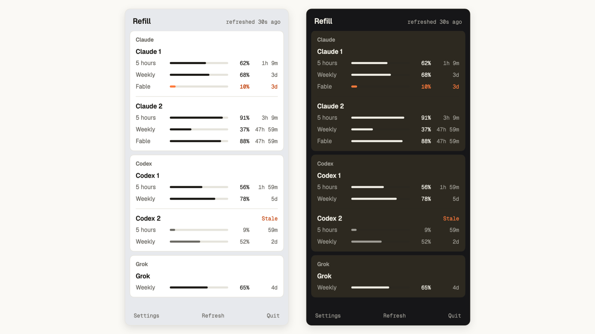
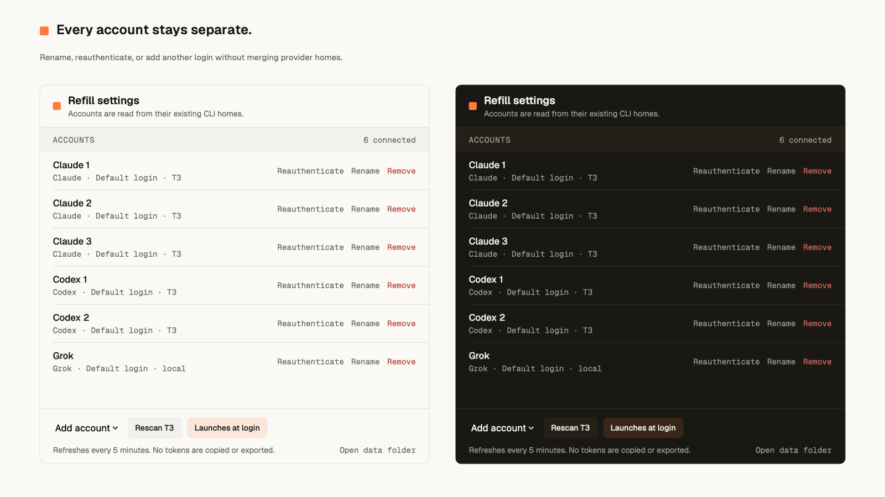
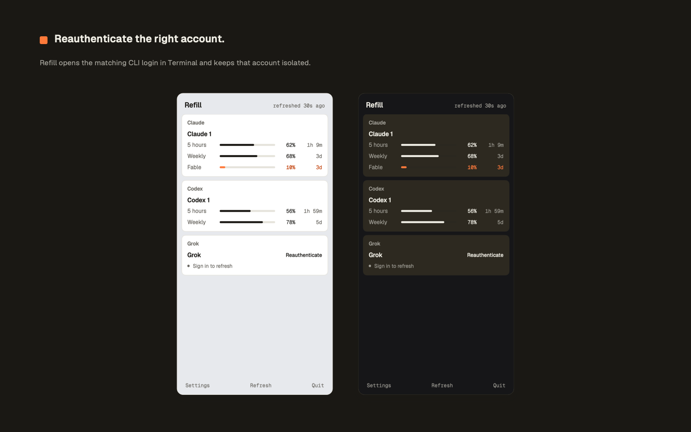

# Refill

Refill shows what's left and when it resets across every Claude, Codex, and Grok account in one native Mac menu.



It discovers T3 provider homes, keeps each login isolated, refreshes every five minutes, preserves the last successful reading while a provider is unavailable, and exports a local machine-readable snapshot. Refill has no analytics, account service, or remote backend.

Claude's session, weekly, and model-scoped limits appear separately. That includes Fable, so `0% left` is visible before another Fable run starts.

## Screenshots





## Requirements

- macOS 13 Ventura or newer
- Apple Command Line Tools for a source install
- A signed-in Claude, Codex, or Grok CLI account

Refill can discover Claude and Codex accounts configured in T3. You can also add the current CLI login or create an isolated login from Settings.

## Install

Install Apple's build tools once if they are not already present:

```sh
xcode-select --install
```

Then build, verify, install, and open Refill:

```sh
git clone https://github.com/10-01/Refill.git
cd Refill
make install
```

The app is installed at `~/Applications/Refill.app`. To update it later, run:

```sh
git pull --ff-only
make install
```

Updating from Leftbar keeps existing account metadata, isolated provider homes, and cached quota values. The installer moves the old app to the Trash after the new build passes verification.

The source install is the supported public path until downloadable builds are signed with a Developer ID and notarized. Building locally avoids asking people to bypass Gatekeeper for an ad hoc signed download.

## How usage is read

- Claude reads the Claude Code credential for each configured home from macOS Keychain, then requests its session, weekly, and model-scoped usage. Fable appears as its own limit when Anthropic returns it for that account.
- Codex starts the local `codex app-server` and calls `account/rateLimits/read` for each Codex home.
- Grok starts the local Grok CLI in an isolated terminal session and parses its `/usage` view.

The status-bar number is the quota left on the tightest window. Each row shows quota left and the reset countdown. If a login expires, use **Reauthenticate** beside that account. Refill opens the matching CLI login in Terminal and preserves the account's isolated home.

These provider interfaces are not a shared public quota standard. A provider update can require an adapter or parser change. Refill is not affiliated with Anthropic, OpenAI, or xAI.

## Privacy and local data

Refill reads existing local CLI credentials only to contact the corresponding provider. It does not copy secrets into its account registry or JSON export. Registry and export files are created with owner-only permissions.

The current snapshot is stored at:

```text
~/Library/Application Support/Refill/refill.json
```

Read the cached snapshot without contacting providers:

```sh
~/Applications/Refill.app/Contents/MacOS/Refill --json
```

Run a live, sanitized provider check:

```sh
~/Applications/Refill.app/Contents/MacOS/Refill --probe
```

The probe includes account display names and quota values, but never tokens. Review it before sharing.

## Development

The build uses Apple's Swift compiler directly, so a full Xcode project is not required.

```sh
make check       # lint, test, build, and verify
make install     # native build into ~/Applications
make package     # universal arm64 + x86_64 ZIP and SHA-256
```

Build output stays in `build/`; release archives stay in `dist/`. Run `make media` to regenerate every screenshot and repository image from the real SwiftUI views. See [ARCHITECTURE.md](ARCHITECTURE.md) for provider and concurrency details, [docs/BRAND.md](docs/BRAND.md) for names and image assets, [docs/PERFORMANCE.md](docs/PERFORMANCE.md) for the measured refresh baseline, and [CONTRIBUTING.md](CONTRIBUTING.md) before opening a pull request.

## Distribution

`make package` creates an ad hoc signed universal archive for local testing. A public binary release should use a Developer ID identity and an Apple notary keychain profile:

```sh
REFILL_SIGNING_IDENTITY="Developer ID Application: Your Name (TEAMID)" \
REFILL_NOTARY_PROFILE="refill-notary" \
make package
```

The package script builds both architectures, enables hardened runtime, verifies the macOS 13 deployment target, submits the ZIP with `notarytool`, staples the ticket, and regenerates the checksum.

## Design

Refill uses the [Otis design system](https://github.com/10-01/otis): warm paper and ink, Geist, and a compact native popover. Quota bars fill in ink. Orange appears when a window is low. It follows the Mac's light or dark appearance.

## License

Refill is available under the [MIT License](LICENSE). Provider integration attribution and bundled font licensing are in [THIRD_PARTY_NOTICES.md](THIRD_PARTY_NOTICES.md).
